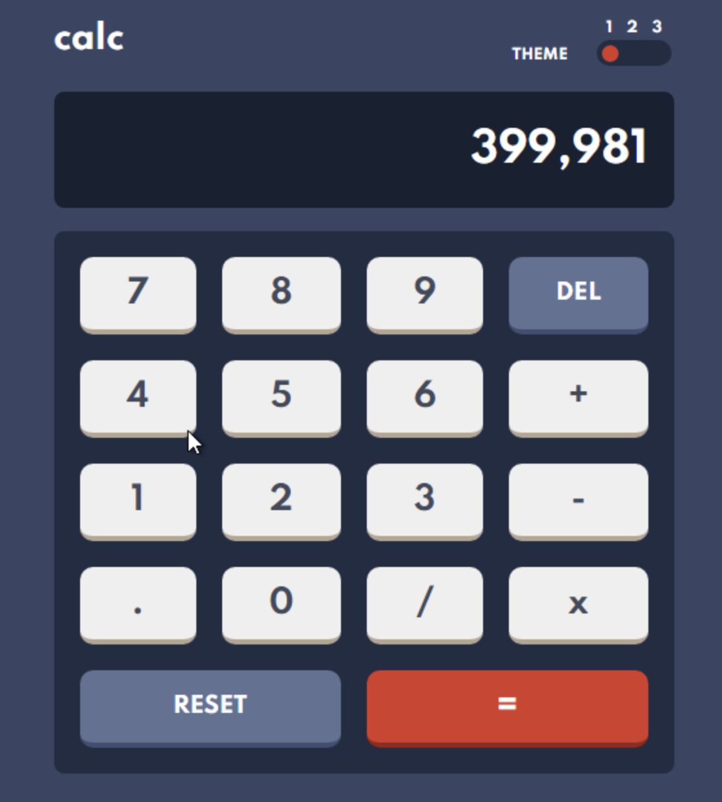
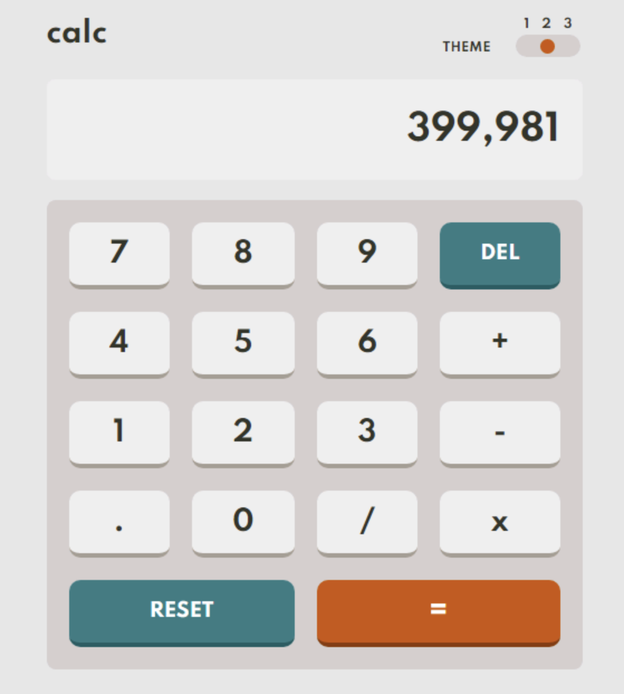
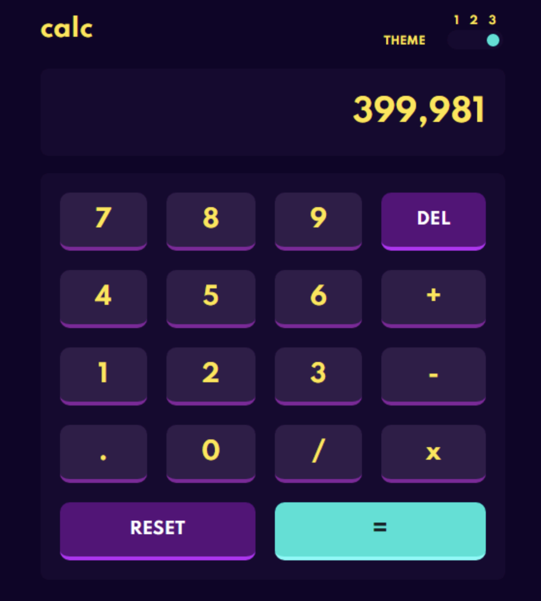

# Frontend Mentor - Calculator app solution

This is a solution to the [Calculator app challenge on Frontend Mentor](https://www.frontendmentor.io/challenges/calculator-app-9lteq5N29). Frontend Mentor challenges help you improve your coding skills by building realistic projects. 

## Table of contents

- [Overview](#overview)
  - [The challenge](#the-challenge)
  - [Screenshots](#screenshots)
  - [Links](#links)
- [My process](#my-process)
  - [Built with](#built-with)
  - [What I learned](#what-i-learned)
  - [Continued development](#continued-development)

## Overview

### The challenge

Users should be able to:

- See the size of the elements adjust based on their device's screen size
- Perform mathmatical operations like addition, subtraction, multiplication, and division
- Adjust the color theme based on their preference
- **Bonus**: Have their initial theme preference checked using `prefers-color-scheme` and have any additional changes saved in the browser

### Screenshots

### Links

- Solution URL: [Add solution URL here](https://your-solution-url.com)

## My process

### Built with

- CSS custom properties
- Flexbox
- CSS Grid
- Sass
- Mobile-first workflow
- [React](https://reactjs.org/) - React framework
- Test-Drive Development (TDD)

### What I learned

CSS Flexbox and Grid.  This project provided a great opportunity to practice 
picture-perfect web design, SCSS and advanced layout techniques with CSS, along with TDD.

### Continued development

More exercise with SCSS, CSS Flexbox/Grid and React.
